## Redis(ka)

1. Скачала файл с данными с сайта https://www.kaggle.com/datasets/natanael127/most-visited-websites-by-hierachycal-categories 

Файл весит 12МБ. 

2. Запуск на одной ноде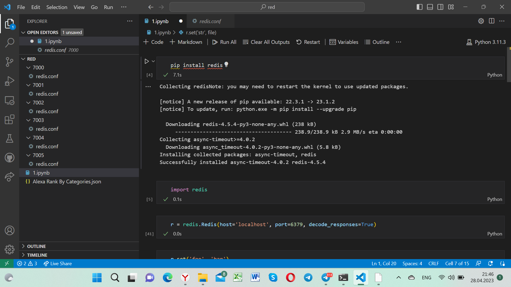
Сохраняем и смотрим время для строки:
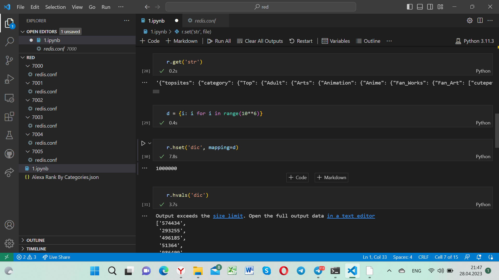
для hset:
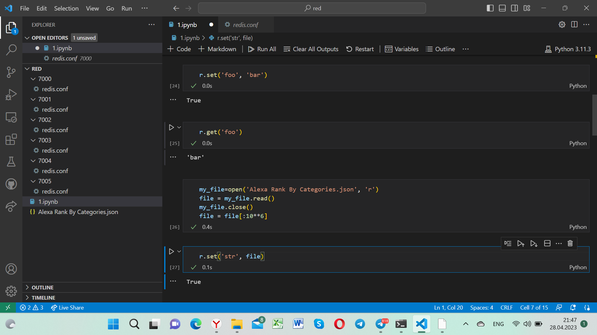
для zset и list:
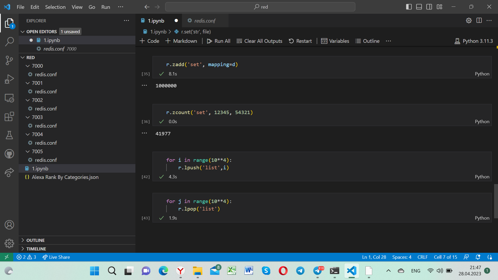
Время работы видно в ячейках VS code 

3. Далее запсукаем те же самые запросы, но уже на кластере из 6 нод. Изначально нужно было 3 ноды, но для надежности используем +3, как реплики.
Запуск на 6 нодах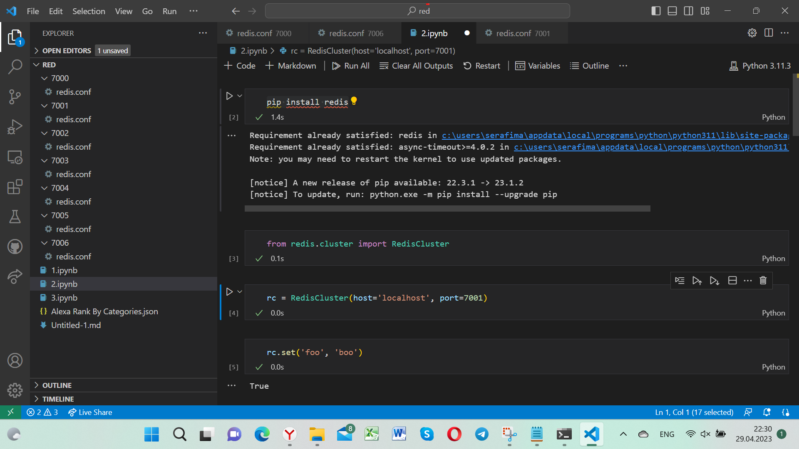
Сохраняем и смотрим время для строки:
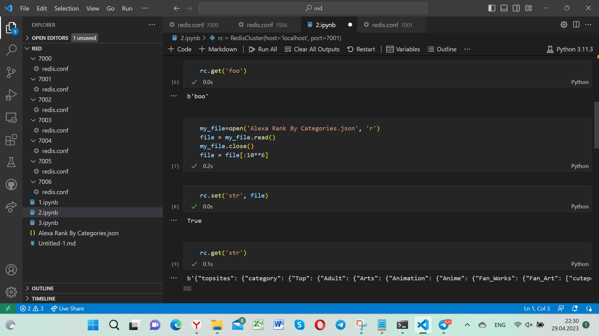
для hset:
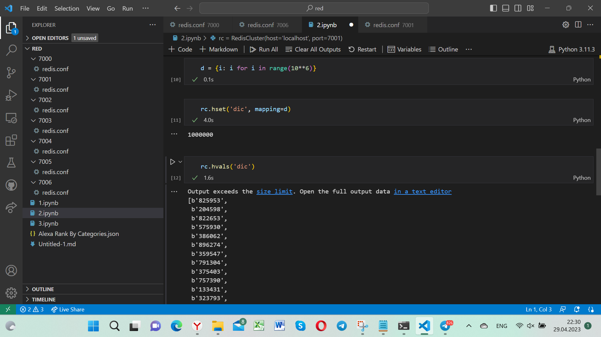
для zset и list:
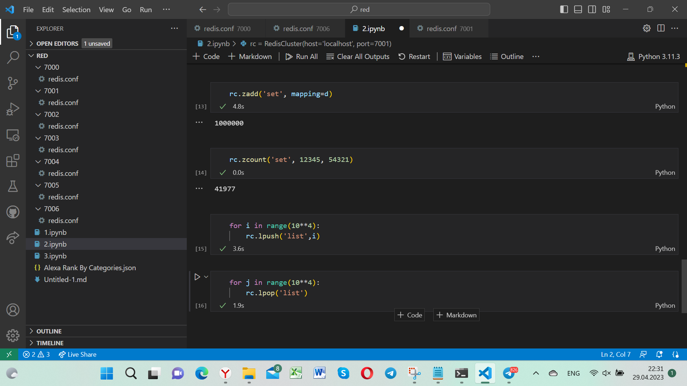
Время работы видно в ячейках VS code 

Вот как выглядела наша нода: 
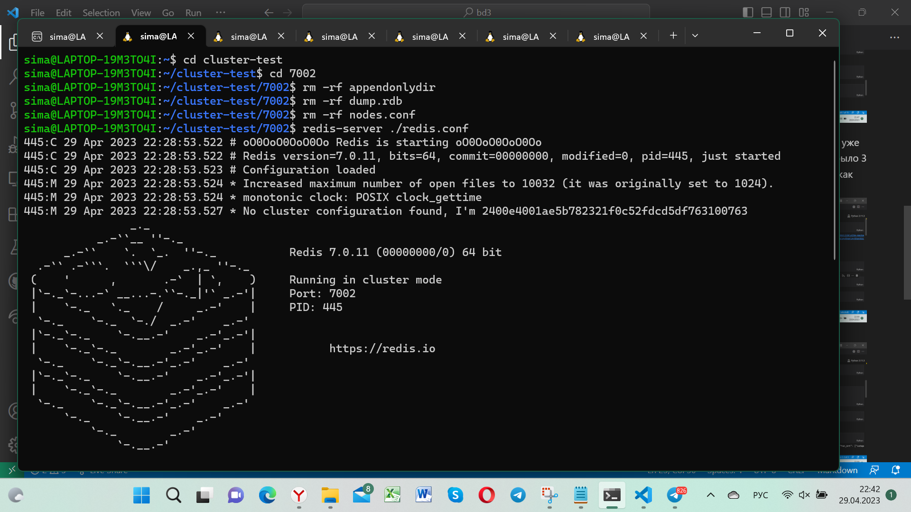
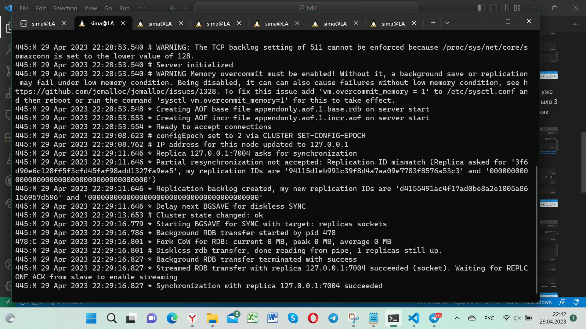
Ну и соответственно запуск кластера:
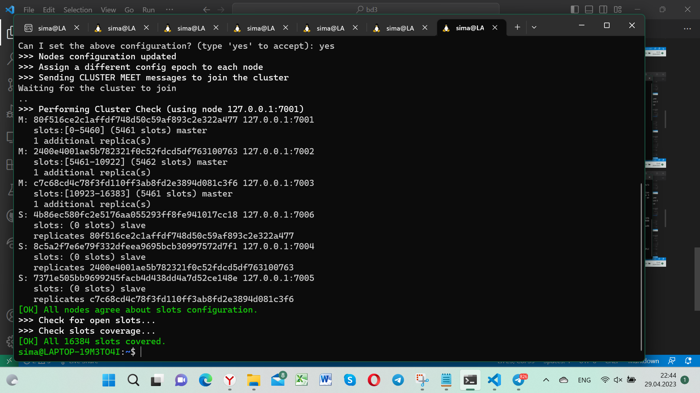

Таким образом, был взят файл JSON большого размера, мы записали его в различных вариациях, а так же запустили редис на 1 ноде и на 6 и посмотрели время работы наших запросов.

